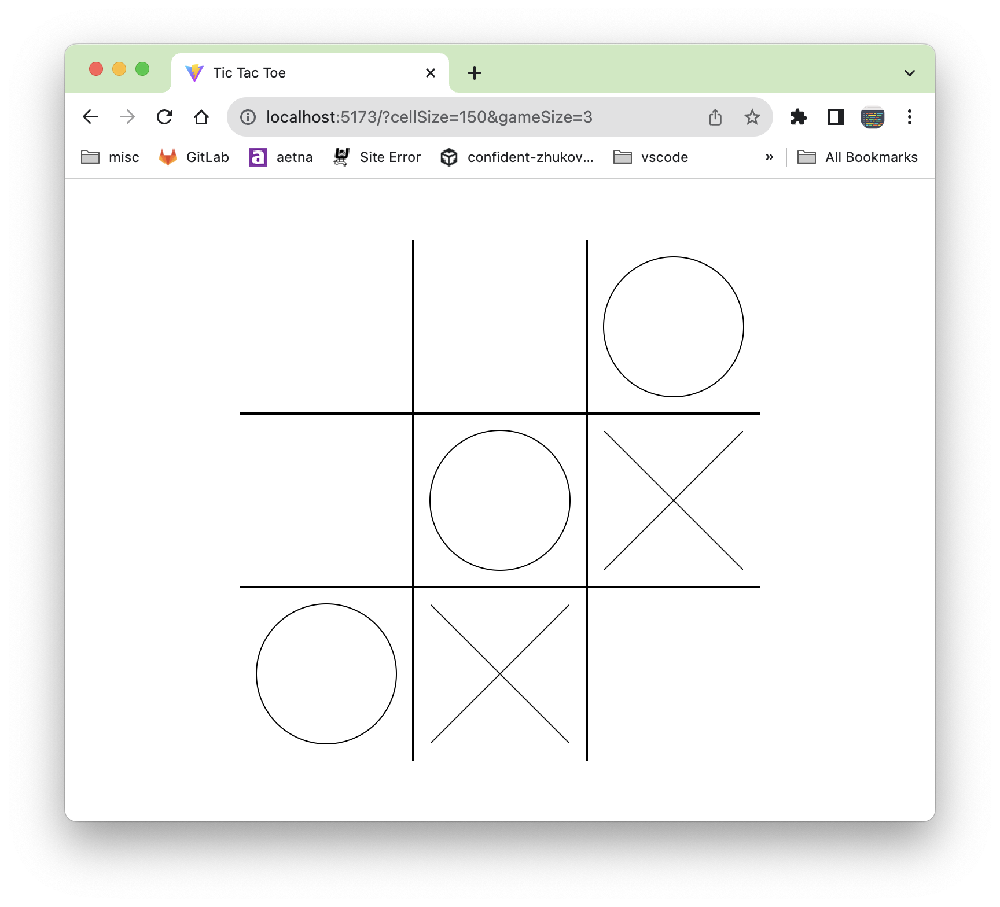
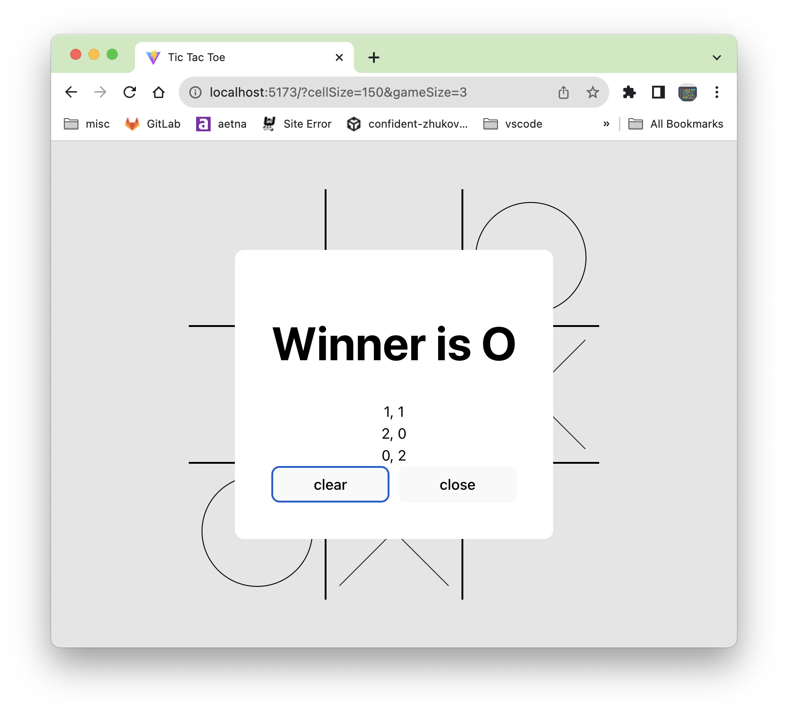

# Tic Tac Toe Game
1. make nxn grid tic tac toe game
1. circle player first, cross player second, take turns
1. when there is a winner, open dialog to declare winner, stop taking turns
1. allow tic tac toe game nxn to be configurable.

# State
1. url `cellSize` and `gameSize` to configure the nxn game.
1. cells (nxn background cells), i.e. `[{row: 0, col: 0}, {row: 0, col: 1}), {row: 0,col: 2)}, ...]`
1. pieces (players pieces), there are two players `O` (circle) and `X` (cross): i.e. `[{row: 0, col: 0, label: 'O'}, {row: 0, col: 1, label: 'X'}), {row: 0, col: 2, label: 'O')}, ...]`
1. winning-pieces (players winning pieces)

# Coding Sample
```jsx
export const Game = () => {
  const game: Partial<UseGame> = useGameSetting();

  return (
    <GameProvider game={game}>
      <GameBoard>
        <GameCells />
        <GamePieces label="O" />
        <GamePieces label="X" />
        <GameToast />
      </GameBoard>
    </GameProvider>
  );
};
```

# Screenshots



